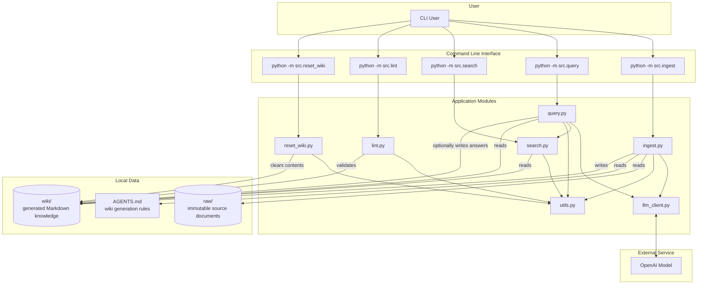

# Wiki Knowledge Base

Wiki Knowledge Base is an experimental local knowledge system that converts raw documents into a persistent Markdown wiki with the help of a large language model.

Instead of answering every question directly from raw files,the application gradually transforms source documents into structured knowledge pages. The generated wiki contains:

- source pages,
- entity pages,
- concept pages,
- a central index,
- an ingestion log,
- generated query answers,
- wiki health reports.

The resulting knowledge base can be browsed directly in the file system or opened in tools such as Obsidian.

## Core Idea

Traditional Retrieval-Augmented Generation usually retrieves document chunks at query time:

```text
question -> retrieve chunks -> generate answer
```

This project follows a different approach:

```text
raw source -> ingest -> structured Markdown wiki -> retrieve pages -> generate answer
```

The raw documents remain unchanged. Knowledge extracted from them is stored permanently as Markdown files and can be reused across multiple queries.

## Main Features

- Convert raw text or Markdown documents into structured wiki pages.
- Generate source,entity,and concept pages using an LLM.
- Store knowledge as human-readable Markdown.
- Use Obsidian-style links between pages.
- Search the wiki locally with BM25.
- Select relevant pages either with local search or an LLM.
- Generate answers based only on selected wiki pages.
- Save generated answers as Markdown pages.
- Validate frontmatter,links,index coverage,and orphan pages.
- Reset generated wiki content without deleting raw documents.

## Project Architecture



## Repository Structure

```text
wiki-knowledge-base/
├── raw/
│   └── source documents
├── wiki/
│   ├── sources/
│   ├── entities/
│   ├── concepts/
│   ├── reports/
│   ├── index.md
│   └── log.md
├── src/
│   ├── __init__.py
│   ├── ingest.py
│   ├── lint.py
│   ├── llm_client.py
│   ├── query.py
│   ├── reset_wiki.py
│   ├── search.py
│   └── utils.py
├── tests/
├── AGENTS.md
├── pyproject.toml
└── README.md
```

## Data Layers

### Raw

The `raw/` directory contains the original source documents.

These files are treated as immutable input data. The application reads them but does not modify or delete them.

### Wiki

The `wiki/` directory contains the generated knowledge base.

It may include:

```text
wiki/sources/
wiki/entities/
wiki/concepts/
wiki/reports/
wiki/index.md
wiki/log.md
```

Each generated page uses Markdown with YAML frontmatter.

### Schema and Rules

The `AGENTS.md` file defines the rules used during ingestion.

It describes how the LLM should structure source pages,entity pages,concept pages,metadata,and internal links.

## Requirements

- Python 3.11
- `uv`
- OpenAI API key

## Installation

Clone the repository:

```bash
git clone https://github.com/KamRoki/wiki-knowledge-base.git
cd wiki-knowledge-base
```

Install the project dependencies:

```bash
uv sync
```

If the dependencies are not yet defined in `pyproject.toml`,add them with:

```bash
uv add openai python-dotenv python-frontmatter rank-bm25
uv add --dev pytest
```

Pin Python 3.11 if necessary:

```bash
uv python pin 3.11
```

## Environment Configuration

Create a `.env` file in the project root:

```env
OPENAI_API_KEY=<your_key_here>
OPENAI_MODEL=gpt-5-mini
```

The `OPENAI_MODEL` variable is optional. If it is not provided,the application uses `gpt-5-mini`.

## Usage

All commands should be executed from the project root.

Because `src` is a Python package,the modules should be started with the `-m` flag.

### Test the OpenAI Connection

If the project contains a connection-check script,you can run it separately before ingestion.

For example:

```bash
uv run python scripts/check_openai.py
```

### Ingest a Source

The source file must be located inside the `raw/` directory.

```bash
uv run python -m src.ingest raw/articles/karpathy-wiki-test.md
```

During ingestion,the application:

1. reads the source document,
2. reads the rules from `AGENTS.md`,
3. sends the source and rules to the LLM,
4. parses the returned JSON,
5. creates a source page,
6. creates or updates entity pages,
7. creates or updates concept pages,
8. updates `wiki/index.md`,
9. appends an entry to `wiki/log.md`.

Example output structure:

```text
wiki/
├── sources/
│   └── karpathy-wiki-test.md
├── entities/
│   └── example-entity.md
├── concepts/
│   └── example-concept.md
├── index.md
└── log.md
```

### Query the Wiki

The default query mode uses local BM25 search to select relevant pages.

```bash
uv run python -m src.query "What is LLM Wiki?"
```

This is equivalent to:

```bash
uv run python -m src.query "What is LLM Wiki?" --mode search
```

### Query with Local Search

```bash
uv run python -m src.query "What is LLM Wiki?" --mode search
```

In this mode,the application:

1. searches the local Markdown wiki with BM25,
2. selects the highest-scoring pages,
3. loads their contents,
4. sends the selected context to the LLM,
5. generates an answer based only on that context.

### Query with LLM Page Selection

```bash
uv run python -m src.query "What is LLM Wiki?" --mode llm
```

In this mode,the LLM first reads `wiki/index.md` and selects up to five relevant pages. The application then loads those pages and asks the model to generate the final answer.

### Save a Generated Answer

```bash
uv run python -m src.query "What is LLM Wiki?" --save
```

The answer is saved as a Markdown page in the wiki.

The command can also be combined with a selection mode:

```bash
uv run python -m src.query "What is LLM Wiki?" --mode llm --save
```

### Search the Wiki Locally

```bash
uv run python -m src.search "LLM Wiki"
```

Limit the number of returned results:

```bash
uv run python -m src.search "LLM Wiki" --limit 10
```

The search module uses BM25 and returns:

- the wiki reference,
- the relevance score,
- a short text snippet.

### Validate Wiki Health

```bash
uv run python -m src.lint
```

The linter checks:

- required YAML frontmatter fields,
- valid page types,
- broken Obsidian links,
- orphan pages,
- pages missing from `index.md`,
- dead links inside `index.md`.

The generated report is saved to:

```text
wiki/reports/health-report.md
```

Possible health statuses:

```text
🟢 no detected issues
🟡 warnings only
🔴 critical problems detected
```

### Reset the Wiki

```bash
uv run python -m src.reset_wiki
```

The reset command removes all generated content inside `wiki/` while preserving the empty `wiki/` directory.

The `raw/` directory and all source documents remain unchanged.

After the reset,the repository will still contain:

```text
raw/
wiki/
```

but the generated knowledge inside `wiki/` will be removed.

## Running Tests

Run the complete test suite:

```bash
uv run pytest
```

For more detailed output:

```bash
uv run pytest -v
```

Run a specific test file:

```bash
uv run pytest tests/test_ingest.py
```

## Main Modules

### `src/ingest.py`

Transforms a raw source document into structured Markdown wiki pages.

### `src/query.py`

Selects relevant wiki pages and generates an answer based on their contents.

### `src/search.py`

Provides local BM25-based retrieval over generated Markdown pages.

### `src/lint.py`

Validates the structure and consistency of the wiki.

### `src/reset_wiki.py`

Clears all generated wiki knowledge while preserving the `wiki/` and `raw/` directories.

### `src/llm_client.py`

Provides a shared OpenAI client and model invocation function.

### `src/utils.py`

Contains shared helpers for file operations,path normalization,slug creation,logging,and wiki references.