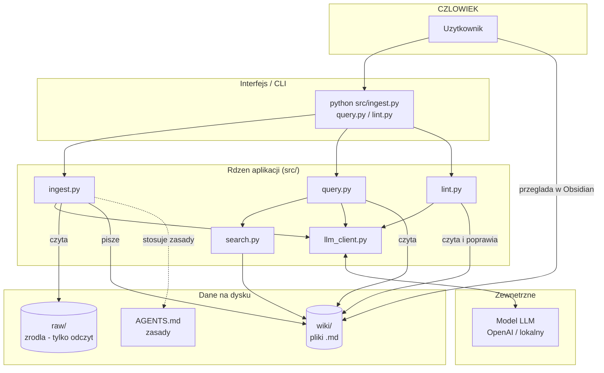

# Wiki Knowledge Base

LLM Wiki is an experimental knowledge base built and maintained by a LLM.
Instead of answering every question from raw documents from scratch, the system gradually converts raw sources into a persistent Markdown wiki. The wiki contains source summaries, entity pages, concept pages, an index and a chronological log.

## Core Idea
Traditional RAG usually works at query time:
```text
question -> retrieve chunks -> generate answer
```

LLM Wiki works more like a compiled knowledge base:
```text
raw source -> ingest -> Markdown wiki -> query
```

The raw files remain immutable. The generated knowledge is stored as Markdown files and can be explored in Obsidian.

## Architektura Systemu


## Setup
```bash
git clone https://github.com/KamRoki/wiki-knowledge-base.git
uv init
uv python pin 3.11
uv venv
uv add openai python-dotenv python-frontmatter rank-bm25
uv add --dev pytest
```

Create .env:
```bash
OPENAI_API_KEY=<your_key_here>
OPENAI_MODEL=gpt-5-mini
```

## Usage
Ingest a source
```bash
uv run python src/ingest.py raw/articles/karpathy-wiki-test.md
```

Query the Wiki
```bash
uv run python src/query.py "What is LLM Wiki?"
```

With search mode
```bash
uv run python src/query.py "What is LLM Wiki?" --mode search
```

With LLM page selection
```bash
uv run python src/query.py "What is LLM Wiki?" --mode llm
```

Search locally
```bash
uv run python src/search.py "LLM Wiki"
```

Lint Wiki health
```bash
uv run python src/lint.py
```

Run tests
```bash
uv run pytest
```

## Layers
Raw - Original source files. They are never modified by code.

Wiki - Generated Markdown pages. This is the persistent knpowledge base.

Schema - AGENTS.md defines the rules for how the system should build and maintain the Wiki.