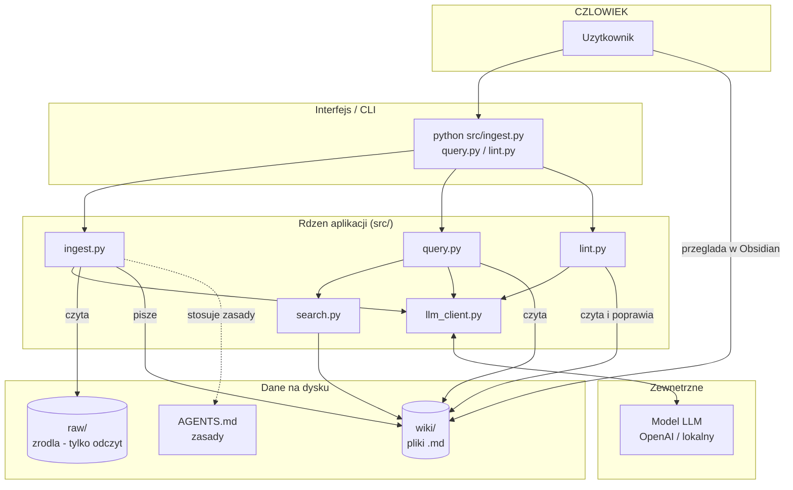

# Wiki Knowledge Base

## Architektura Systemu

```mermaid
graph TB
    subgraph HUMAN["CZLOWIEK"]
        U[Uzytkownik]
    end

    subgraph CLI["Interfejs / CLI"]
        CMD[python src/ingest.py<br/>query.py / lint.py]
    end

    subgraph CORE["Rdzen aplikacji (src/)"]
        ING[ingest.py]
        QRY[query.py]
        LNT[lint.py]
        SRCH[search.py]
        LLM[llm_client.py]
    end

    subgraph DATA["Dane na dysku"]
        RAW[(raw/<br/>zrodla - tylko odczyt)]
        WIKI[(wiki/<br/>pliki .md)]
        SCHEMA[AGENTS.md<br/>zasady]
    end

    subgraph EXT["Zewnetrzne"]
        MODEL[Model LLM<br/>OpenAI / lokalny]
    end

    U --> CMD
    CMD --> ING & QRY & LNT
    ING --> LLM
    QRY --> SRCH
    QRY --> LLM
    LNT --> LLM
    SRCH --> WIKI
    LLM <--> MODEL
    ING -->|czyta| RAW
    ING -->|pisze| WIKI
    ING -.->|stosuje zasady| SCHEMA
    QRY -->|czyta| WIKI
    LNT -->|czyta i poprawia| WIKI
    U -->|przeglada w Obsidian| WIKI
```