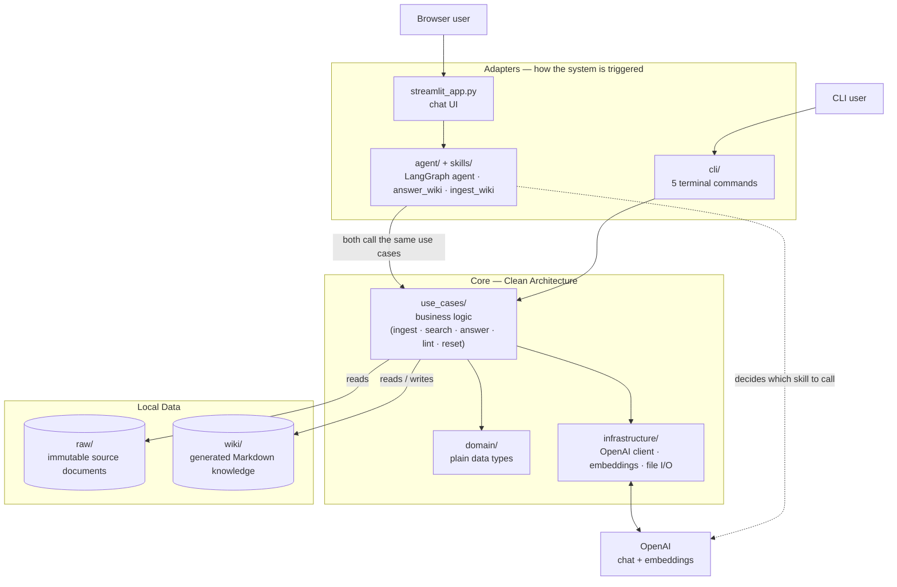

# Wiki Knowledge Base

Wiki Knowledge Base is an experimental local knowledge system that converts raw documents into a persistent Markdown wiki with the help of a large language model.

Instead of answering every question directly from raw files,the application gradually transforms source documents into structured knowledge pages. The generated wiki contains:

- source pages,
- entity pages,
- concept pages,
- a central index,
- an ingestion log,
- generated query answers,
- wiki health reports.

The resulting knowledge base can be browsed directly in the file system or opened in tools such as Obsidian. It can also be used through a conversational AI agent (LangGraph) with a Streamlit chat interface, in addition to the command-line tools.

## Core Idea

Traditional Retrieval-Augmented Generation usually retrieves document chunks at query time:

```text
question -> retrieve chunks -> generate answer
```

This project follows a different approach:

```text
raw source -> ingest -> structured Markdown wiki -> retrieve pages -> generate answer
```

The raw documents remain unchanged. Knowledge extracted from them is stored permanently as Markdown files and can be reused across multiple queries.

## Main Features

- Convert raw text or Markdown documents into structured wiki pages.
- Generate source,entity,and concept pages using an LLM.
- Store knowledge as human-readable Markdown.
- Use Obsidian-style links between pages.
- Search the wiki locally using semantic search (OpenAI embeddings).
- Select relevant pages either with semantic search or an LLM.
- Generate answers based only on selected wiki pages.
- Save generated answers as Markdown pages.
- Validate frontmatter,links,index coverage,and orphan pages.
- Reset generated wiki content without deleting raw documents.
- Talk to the wiki through an AI agent (LangGraph) with two skills — `answer_wiki` and `ingest_wiki` — exposed via a Streamlit chat UI.

## Project Architecture

The codebase follows a simplified **Clean Architecture**: business logic (`use_cases/`) is independent from technical details (`infrastructure/`) and from the way it is triggered (`cli/`, `skills/` + `agent/`, `streamlit_app.py`). The CLI and the agent call the exact same use cases — no logic is duplicated between the two entry points.



Every box above is a folder,not a single file — see **Repository Structure** for the exact files inside each layer,and **Main Modules** for what each file does. The one detail worth calling out here: the CLI and the agent are two different ways to *trigger* the system,but they both call the exact same `use_cases/` — no business logic is duplicated between them.

## Repository Structure

```text
wiki-knowledge-base/
├── raw/
│   └── source documents
├── wiki/
│   ├── sources/
│   ├── entities/
│   ├── concepts/
│   ├── reports/
│   ├── index.md
│   └── log.md
├── src/
│   ├── __init__.py
│   ├── domain/            # plain data types (dataclasses)
│   │   ├── wiki_page.py
│   │   ├── search_result.py
│   │   ├── ingest_summary.py
│   │   ├── answer_result.py
│   │   └── reset_summary.py
│   ├── use_cases/         # business logic, framework-independent
│   │   ├── ingest_source.py
│   │   ├── search_wiki.py
│   │   ├── answer_question.py
│   │   ├── lint_wiki.py
│   │   └── reset_wiki.py
│   ├── infrastructure/    # technical details
│   │   ├── file_utils.py
│   │   ├── wiki_repository.py
│   │   ├── raw_repository.py
│   │   ├── llm_client.py
│   │   └── embeddings.py
│   ├── cli/                # command-line adapters
│   │   ├── ingest.py
│   │   ├── search.py
│   │   ├── query.py
│   │   ├── lint.py
│   │   └── reset_wiki.py
│   ├── skills/              # LangChain tools used by the agent
│   │   ├── answer_wiki.py
│   │   └── ingest_wiki.py
│   └── agent/                # LangGraph agent definition
│       └── graph.py
├── streamlit_app.py        # chat UI for the agent
├── tests/
├── AGENTS.md
├── pyproject.toml
└── README.md
```

## Data Layers

### Raw

The `raw/` directory contains the original source documents.

These files are treated as immutable input data. The application reads them but does not modify or delete them.

### Wiki

The `wiki/` directory contains the generated knowledge base.

It may include:

```text
wiki/sources/
wiki/entities/
wiki/concepts/
wiki/reports/
wiki/index.md
wiki/log.md
```

Each generated page uses Markdown with YAML frontmatter.

### Schema and Rules

The `AGENTS.md` file defines the rules used during ingestion.

It describes how the LLM should structure source pages,entity pages,concept pages,metadata,and internal links.

## Requirements

- Python 3.11
- `uv`
- OpenAI API key (used for chat completions and for embeddings)

## Installation

Clone the repository:

```bash
git clone https://github.com/KamRoki/wiki-knowledge-base.git
cd wiki-knowledge-base
```

Install the project dependencies:

```bash
uv sync
```

If the dependencies are not yet defined in `pyproject.toml`,add them with:

```bash
uv add openai python-dotenv python-frontmatter langchain langchain-openai langgraph streamlit
uv add --dev pytest
```

Pin Python 3.11 if necessary:

```bash
uv python pin 3.11
```

## Environment Configuration

Create a `.env` file in the project root:

```env
OPENAI_API_KEY=<your_key_here>
OPENAI_MODEL=gpt-5-mini
```

The `OPENAI_MODEL` variable is optional. If it is not provided,the application uses `gpt-5-mini`. The same key is used for chat completions (ingest, query, agent) and for embeddings (semantic search).

## Usage

All commands should be executed from the project root.

Because `src` is a Python package,the modules should be started with the `-m` flag.

### Ingest a Source

The source file must be located inside the `raw/` directory.

```bash
uv run python -m src.cli.ingest raw/articles/karpathy-wiki-test.md
```

During ingestion,the application:

1. reads the source document,
2. reads the rules from `AGENTS.md`,
3. sends the source and rules to the LLM,
4. parses the returned JSON,
5. creates a source page,
6. creates or updates entity pages,
7. creates or updates concept pages,
8. updates `wiki/index.md`,
9. appends an entry to `wiki/log.md`.

Example output structure:

```text
wiki/
├── sources/
│   └── karpathy-wiki-test.md
├── entities/
│   └── example-entity.md
├── concepts/
│   └── example-concept.md
├── index.md
└── log.md
```

### Query the Wiki

The default query mode uses local semantic search (embeddings) to select relevant pages.

```bash
uv run python -m src.cli.query "What is LLM Wiki?"
```

This is equivalent to:

```bash
uv run python -m src.cli.query "What is LLM Wiki?" --mode search
```

### Query with Local Search

```bash
uv run python -m src.cli.query "What is LLM Wiki?" --mode search
```

In this mode,the application:

1. embeds every wiki page and the question, and ranks pages by semantic similarity,
2. selects the highest-scoring pages,
3. loads their contents,
4. sends the selected context to the LLM,
5. generates an answer based only on that context.

### Query with LLM Page Selection

```bash
uv run python -m src.cli.query "What is LLM Wiki?" --mode llm
```

In this mode,the LLM first reads `wiki/index.md` and selects up to five relevant pages. The application then loads those pages and asks the model to generate the final answer.

### Save a Generated Answer

```bash
uv run python -m src.cli.query "What is LLM Wiki?" --save
```

The answer is saved as a Markdown page in the wiki.

The command can also be combined with a selection mode:

```bash
uv run python -m src.cli.query "What is LLM Wiki?" --mode llm --save
```

### Search the Wiki Locally

```bash
uv run python -m src.cli.search "LLM Wiki"
```

Limit the number of returned results:

```bash
uv run python -m src.cli.search "LLM Wiki" --limit 10
```

The search command uses semantic search (OpenAI embeddings, no local keyword index) and returns:

- the wiki reference,
- the relevance score,
- a short text snippet.

Because every search embeds the wiki pages through the OpenAI API,it requires network access and incurs a (small) API cost,unlike a purely local keyword index.

### Validate Wiki Health

```bash
uv run python -m src.cli.lint
```

The linter checks:

- required YAML frontmatter fields,
- valid page types,
- broken Obsidian links,
- orphan pages,
- pages missing from `index.md`,
- dead links inside `index.md`.

The generated report is saved to:

```text
wiki/reports/health-report.md
```

Possible health statuses:

```text
🟢 no detected issues
🟡 warnings only
🔴 critical problems detected
```

### Reset the Wiki

```bash
uv run python -m src.cli.reset_wiki
```

The reset command removes all generated content inside `wiki/` while preserving the empty `wiki/` directory.

The `raw/` directory and all source documents remain unchanged.

After the reset,the repository will still contain:

```text
raw/
wiki/
```

but the generated knowledge inside `wiki/` will be removed.

### Talk to the Wiki Through the Agent (Streamlit)

```bash
uv run streamlit run streamlit_app.py
```

This opens a chat interface backed by a LangGraph agent with two skills:

- **`answer_wiki`** — used when the message is a question about the wiki. It runs the same semantic search and answer generation as `src.cli.query --mode search`.
- **`ingest_wiki`** — used when the message asks to ingest a file from `raw/`. It runs the same logic as `src.cli.ingest`.

The agent decides which skill to use based on the message. The sidebar lists the files currently in `raw/` and offers a button that sends an ingest request for the selected file,so the file name is always exact instead of being guessed from free text.

## Running Tests

Run the complete test suite:

```bash
uv run pytest
```

For more detailed output:

```bash
uv run pytest -v
```

Run a specific test file:

```bash
uv run pytest tests/use_cases/test_ingest_source.py
```

## Main Modules

### `src/domain/`

Plain dataclasses describing the core concepts of the system (`WikiPage`,`SearchResult`,`IngestSummary`,`AnswerResult`,`ResetSummary`). No dependency on the rest of the codebase.

### `src/use_cases/`

Business logic,independent from the CLI,the agent,or Streamlit:

- `ingest_source.py` — transforms a raw source document into structured Markdown wiki pages.
- `search_wiki.py` — finds wiki pages relevant to a query.
- `answer_question.py` — selects relevant wiki pages and generates an answer based on their contents.
- `lint_wiki.py` — validates the structure and consistency of the wiki.
- `reset_wiki.py` — clears all generated wiki knowledge while preserving the `wiki/` and `raw/` directories.

### `src/infrastructure/`

Technical details used by the use cases:

- `llm_client.py` — shared OpenAI client and chat completion helper.
- `embeddings.py` — semantic search over wiki pages using OpenAI embeddings.
- `wiki_repository.py` — reading/writing wiki pages,`index.md`,and `log.md`.
- `raw_repository.py` — listing and validating files inside `raw/`.
- `file_utils.py` — generic file I/O and slug creation.

### `src/cli/`

Thin `argparse` wrappers around the use cases — the commands documented above.

### `src/skills/` and `src/agent/`

`skills/` exposes `answer_wiki` and `ingest_wiki` as LangChain tools that call the same use cases as the CLI. `agent/graph.py` wires them into a LangGraph agent (an LLM node with tool-calling,looped with a tool-execution node) used by `streamlit_app.py`.
